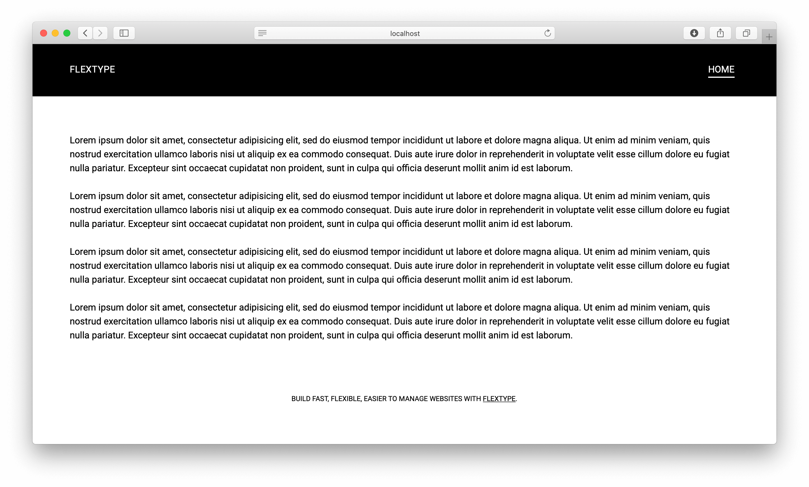

<h1 align="center">Noir Theme for <a href="http://flextype.org/">Flextype</a></h1>

    

## Features

* Nice minimalistic black and white theme
* Powered by Tailwind CSS

## Dependencies

The following dependencies need to be downloaded and installed for Noir Theme.

### System

| Item | Version | Download |
|---|---|---|
| [flextype](https://github.com/flextype/flextype) | 0.9.8 | [download](https://github.com/flextype/flextype/releases/download/v0.9.8/flextype-0.9.8.zip) |

### Plugins
| Item | Version | Download |
|---|---|---|
| [site](https://github.com/flextype-plugins/site) | 1.0.0 | [download](https://github.com/flextype-plugins/site/releases/download/v1.0.0/site-1.0.0.zip) |
| [twig](https://github.com/flextype-plugins/twig) | 1.0.0 | [download](https://github.com/flextype-plugins/twig/releases/download/v1.0.0/twig-1.0.0.zip) |

## Installation

1. Download & Install all required dependencies.
2. Create new folder `/project/themes/noir`
3. Download Noir Theme and unzip theme to the folder `/project/themes/noir`

## LICENSE
[The MIT License (MIT)](https://github.com/flextype-themes/noir/blob/master/LICENSE.txt)
Copyright (c) 2018-2020 [Sergey Romanenko](https://github.com/Awilum)
